# Panduan Pengguna (User Manual) - Dashboard Visualisasi Properti Jabodetabek

Selamat datang di Panduan Pengguna untuk **Aplikasi Dashboard Visualisasi Properti Jabodetabek**. Aplikasi ini dirancang untuk membantu Anda (calon pembeli rumah, agen properti, pengembang, maupun penilai pajak) dalam menganalisis kewajaran harga properti residensial berdasarkan perbandingannya dengan Nilai Jual Objek Pajak (NJOP) tahun 2025 di wilayah Jabodetabek.

Panduan ini disusun khusus bagi end-user dan berfokus sepenuhnya pada petunjuk interaksi antarmuka web, navigasi fitur lengkap, pembacaan peta, serta contoh skenario praktis penggunaan aplikasi sehari-hari.

---

## Daftar Isi
1. [Tujuan & Konsep Analisis](#1-tujuan--konsep-analisis)
2. [Memahami Tampilan Beranda & Status Data](#2-memahami-tampilan-beranda--status-data)
3. [Fitur Penyaringan (Filter) Global](#3-fitur-penyaringan-filter-global)
4. [Eksplorasi Spasial pada Peta Interaktif (Tab Peta)](#4-eksplorasi-spasial-pada-peta-interaktif-tab-peta)
   - [Panel Layers & Overlay Peta](#panel-layers--overlay-peta)
   - [Penelusuran Galeri Properti (Drill-Down)](#penelusuran-galeri-properti-drill-down)
5. [Menganalisis Grafik & Tabel (Tab Analitik)](#5-menganalisis-grafik--tabel-tab-analitik)
6. [Penilaian Risiko Lingkungan & Keamanan (Tab Risiko)](#6-penilaian-risiko-lingkungan--keamanan-tab-risiko)
7. [Membaca Berita Terkini RSS Feed (Tab Berita)](#7-membaca-berita-terkini-rss-feed-tab-berita)
8. [Studi Kasus Penggunaan Praktis](#8-studi-kasus-penggunaan-praktis)

---

## 1. Tujuan & Konsep Analisis

Aplikasi ini menggunakan perhitungan **Rasio Harga/NJOP** sebagai standar utama untuk mengukur kewajaran harga properti di pasar bebas terhadap nilai ketetapan pajak resmi dari pemerintah daerah.

$$\text{Rasio Harga/NJOP} = \frac{\text{Harga Pasar per m}^2\text{ Tanah}}{\text{NJOP per m}^2\text{ Resmi}}$$

### Klasifikasi 4 Segmen Harga:
1. **Segmen Rendah (Rasio < 1.0x)**: Harga jual properti di bawah NJOP resmi (*undervalued*). Properti murah, namun pembeli harus waspada terhadap potensi masalah akses, sengketa, atau risiko banjir.
2. **Segmen Menengah (Rasio 1.0x – < 2.0x)**: Rentang harga wajar dan normal. Pilihan paling aman untuk tempat tinggal karena mencerminkan harga pasar yang stabil.
3. **Segmen Tinggi (Rasio 2.0x – < 3.0x)**: Wilayah yang sedang berkembang atau memiliki kelengkapan infrastruktur publik yang baik.
4. **Segmen Premium (Rasio $\ge$ 3.0x)**: Kawasan eksklusif atau pusat bisnis (CBD). Harga lebih didominasi oleh prestise lokasi dan nilai komersial dibanding sekadar fisik bangunan.

---

## 2. Memahami Tampilan Beranda & Status Data

Saat pertama kali membuka aplikasi, Anda akan disambut oleh halaman dashboard utama yang terdiri dari Header, Kartu KPI, dan Area Peta.

*Gambar 1: Antarmuka utama menampilkan status sinkronisasi, ringkasan KPI, filter, dan peta spasial.*

### Penjelasan Komponen Utama:
- **Indikator Live (Kanan Atas)**: Titik hijau berlabel "Live" menandakan bahwa aplikasi berhasil terhubung secara _real-time_ ke Google News RSS Feed untuk memperbarui data indeks berita banjir dan kejahatan.
- **Total Listing**: Jumlah unit rumah (iklan aktif) yang saat ini masuk dalam cakupan filter pencarian Anda.
- **Rata-rata Rasio Harga/NJOP**: Rata-rata kelipatan harga pasar di atas NJOP untuk wilayah yang sedang Anda lihat.
- **Median Harga**: Nilai tengah harga rumah yang menyaring pencilan (harga yang terlampau murah/mahal).
- **Segmen Dominan**: Menunjukkan kategori harga yang paling banyak mewarnai kawasan tersebut.

---

## 3. Fitur Penyaringan (Filter) Global

Di bagian bawah kartu-kartu KPI, terdapat bilah penyaringan (filter) global berwarna gelap. Filter ini sangat penting untuk menyempitkan skala analisis Anda.

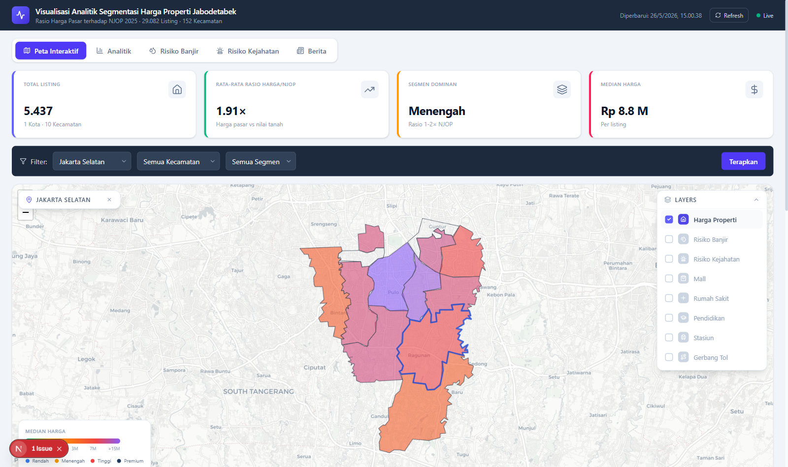
*Gambar 2: Seluruh tampilan peta dan metrik akan otomatis ter-update setelah Anda memilih opsi "Jakarta Selatan".*

1. **Filter Kota**: Pilih salah satu kota di Jabodetabek (misal: Jakarta Selatan) untuk membatasi wilayah.
2. **Filter Kecamatan**: Setelah kota dipilih, opsi ini akan otomatis menyesuaikan daftar kecamatan yang hanya berada di dalam kota tersebut.
3. **Filter Segmen**: Fokuskan pencarian Anda hanya pada kategori harga tertentu (misal: "Rendah" atau "Premium").
4. **Sistem Real-time**: Anda tidak perlu menekan tombol 'Cari'. Setiap kali Anda mengubah pilihan dropdown, peta spasial dan semua angka statistik akan berubah seketika (*instant-update*).

---

## 4. Eksplorasi Spasial pada Peta Interaktif (Tab Peta)

Peta Interaktif merupakan inti visualisasi dari aplikasi ini. Area peta menggunakan gradasi warna (*choropleth*) di mana warna kemerahan menunjukkan kawasan elit (Premium/Tinggi), sedangkan warna hijau/kuning menunjukkan kawasan terjangkau (Menengah/Rendah).

*Gambar 3: Gradasi peta choropleth yang menunjukkan tingkat kemahalan properti (Rasio H/NJOP).*

### Panel Layers & Overlay Peta
Peta ini dilengkapi dengan kontrol Layer yang sangat lengkap di pojok kanan atas peta. Anda dapat menumpuk visualisasi data (*overlay*) untuk analisis multivariabel.

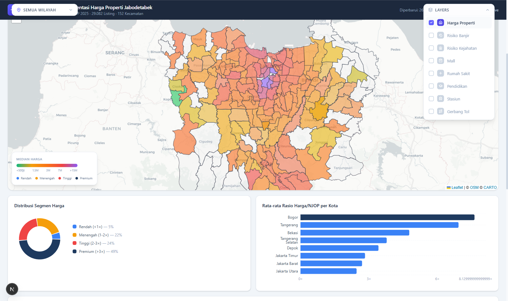
*Gambar 4: Menu pop-up Layers.*

1. **Klik tombol "LAYERS"** (di pojok kanan atas area peta).
2. Anda akan melihat daftar layer opsional yang bisa dihidupkan (dicentang):
   - **Fasilitas Umum**: Centang **Mall**, **Rumah Sakit**, **Pendidikan**, **Stasiun**, atau **Gerbang Tol**. Peta akan dipenuhi titik marker yang melambangkan lokasi infrastruktur publik tersebut.
   - **Risiko Banjir**: Mengganti pewarnaan peta menjadi peta risiko banjir. Merah tua berarti bahaya tinggi, hijau berarti aman.
   - **Risiko Kejahatan**: Mengganti pewarnaan peta menjadi peta tingkat kriminalitas berbasis pantauan berita RSS.

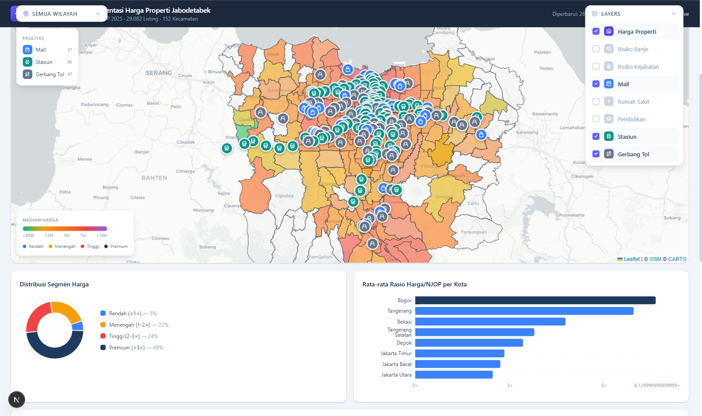
*Gambar 5: Marker fasilitas publik (Stasiun, Gerbang Tol, Mall) diaktifkan secara bersamaan.*

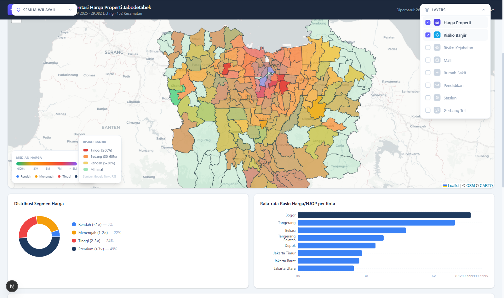
*Gambar 6: Mode Peta Risiko Banjir aktif, memetakan kawasan paling rawan (merah).*

### Filter Wilayah Cepat (On-Map)
Di pojok kiri atas peta, terdapat tombol putih kecil bertuliskan **SEMUA WILAYAH**. Anda dapat mengkliknya untuk secara cepat memfokuskan (*zoom*) kamera peta ke satu kota spesifik tanpa harus menggunakan filter global di luar peta.

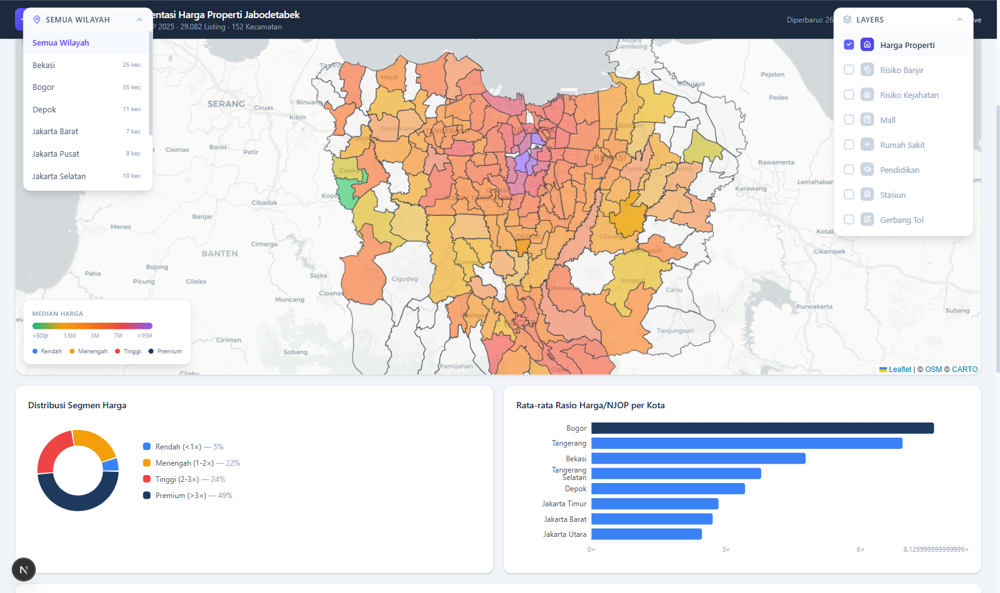
*Gambar 7: Fitur zoom cepat tingkat kota langsung di dalam peta.*

### Penelusuran Galeri Properti (Drill-Down)
Fitur paling canggih dalam aplikasi ini adalah kemampuan **Drill-Down 2-Langkah** untuk melihat galeri foto unit rumah secara langsung dari peta.

**Langkah 1:** Klik salah satu poligon kecamatan di peta. Sebuah balon informasi (*popup*) akan muncul menyajikan ringkasan statistik (Median Harga, Skor Fasilitas, Jarak Tol terdekat).

*Gambar 8: Popup ringkasan data kecamatan muncul saat area diklik.*

**Langkah 2:** Di dalam balon informasi tersebut, klik tombol biru bertuliskan **"Lihat Semua Listing &rarr;"**.

*Gambar 9: Galeri properti terbuka, menampilkan kartu unit rumah lengkap dengan harga, spesifikasi, dan foto asli.*

Setelah galeri terbuka, Anda dapat meninjau (scroll) semua unit properti di kecamatan tersebut. Klik tombol **"Buka Sumber Iklan"** pada tiap kartu rumah untuk melompat langsung ke website *Rumah123* asli tempat rumah tersebut dijual.

---

## 5. Menganalisis Grafik & Tabel (Tab Analitik)

Klik tab **Analitik** pada bilah navigasi utama untuk memunculkan panel dashboard visualisasi kuantitatif.

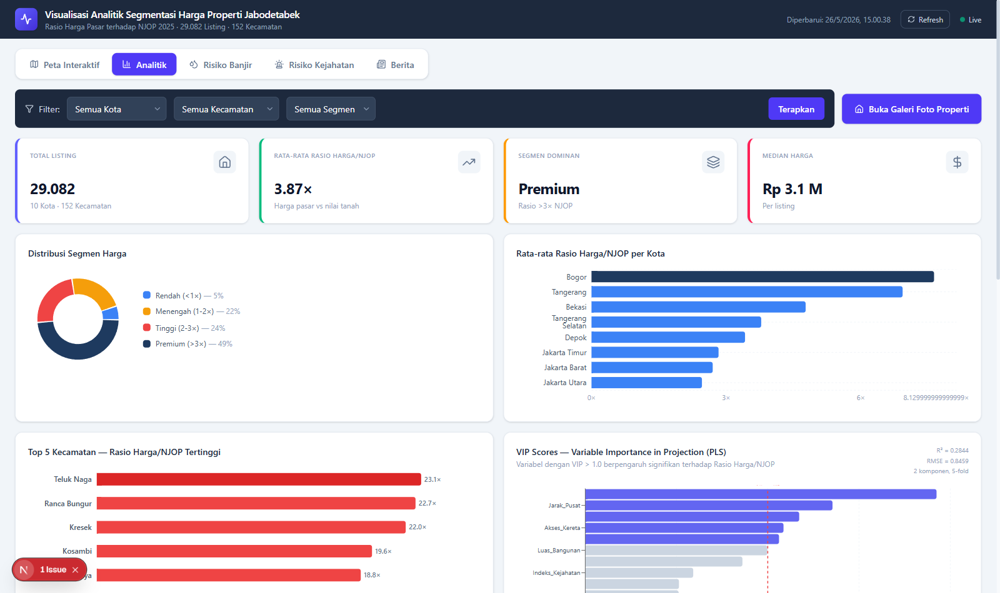
*Gambar 10: Tampilan awal panel Analitik.*

Bagian ini menyajikan empat instrumen utama:
1. **Distribusi Segmen Harga (Donut Chart)**: Menunjukkan persentase pasar properti.
2. **Rata-rata Rasio per Kota (Bar Chart Horizontal)**: Mengurutkan peringkat kota dari yang paling mahal deviasi pasarnya terhadap NJOP (biasanya didominasi Jakarta Selatan dan Pusat).
3. **Top 5 Kecamatan (Bar Chart)**: Menyoroti wilayah kecamatan yang nilai pasarnya paling "berontak" dari ketetapan pajak pemerintah. Sangat berguna bagi auditor pajak Pemda.
4. **Grafik Pengaruh Faktor Spasial (VIP PLS-SEM)**: Mengilustrasikan variabel apa saja yang paling kuat mendikte kelipatan harga. Garis merah putus-putus menandakan ambang batas pengaruh (*threshold*). Variabel dengan balok biru melampaui garis merah (seperti Jarak ke Monas atau NJOP dasar) adalah pemicu utama kenaikan harga properti.

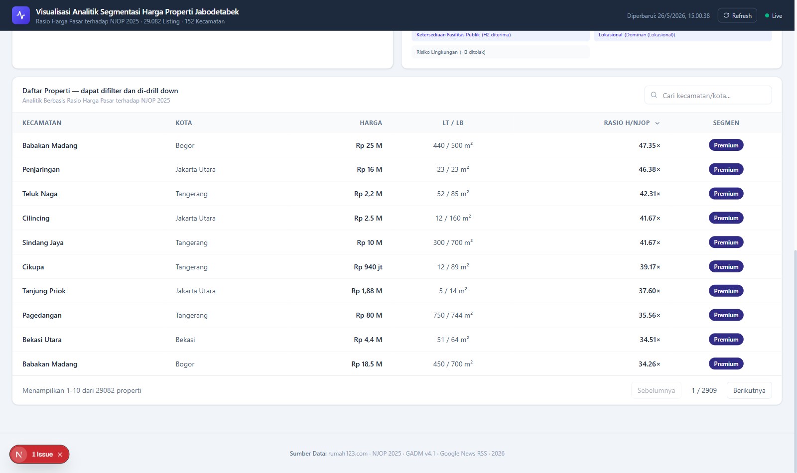
*Gambar 11: Tabel daftar properti interaktif dengan fitur pencarian dan pengurutan kolom.*

Di bagian bawah tab Analitik, Anda akan menemukan **Tabel Data Properti**. Tabel ini bisa diurutkan dari yang termurah ke termahal, serta memiliki kotak pencarian dinamis untuk mencari kelurahan atau nama jalan.

---

## 6. Penilaian Risiko Lingkungan & Keamanan (Tab Risiko)

Keputusan properti tidak hanya soal harga, tapi juga keamanan. Sistem menyertakan dua tab mitigasi risiko:

**Tab Risiko Banjir**  
Menampilkan daftar kecamatan yang diurutkan berdasarkan Indeks Kerawanan Banjir tingkat tinggi.
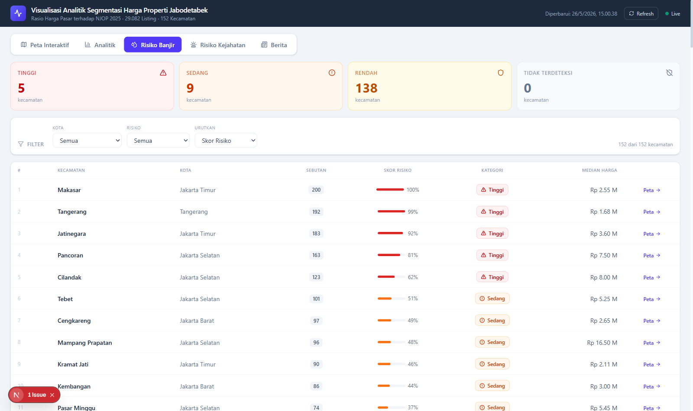

**Tab Risiko Kejahatan**  
Meringkas wilayah mana saja yang berstatus Rawan berdasarkan pemantauan pemberitaan portal berita (crime rate).
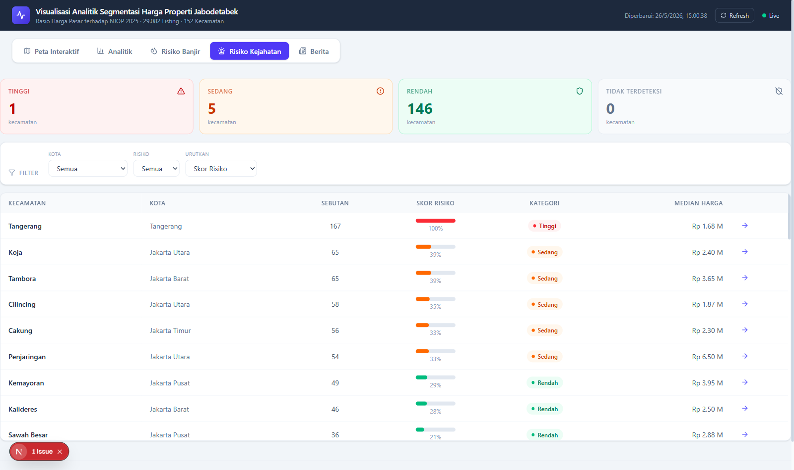

*Kedua tab ini dilengkapi dengan running text otomatis yang merangkum poin-poin krusial dari media massa secara live.*

---

## 7. Membaca Berita Terkini RSS Feed (Tab Berita)

Aplikasi memiliki mesin pemantau *scraper* internal. Klik tab **Berita** untuk membuka kliping artikel surat kabar digital terkini seputar Banjir dan Kriminalitas di Jabodetabek.

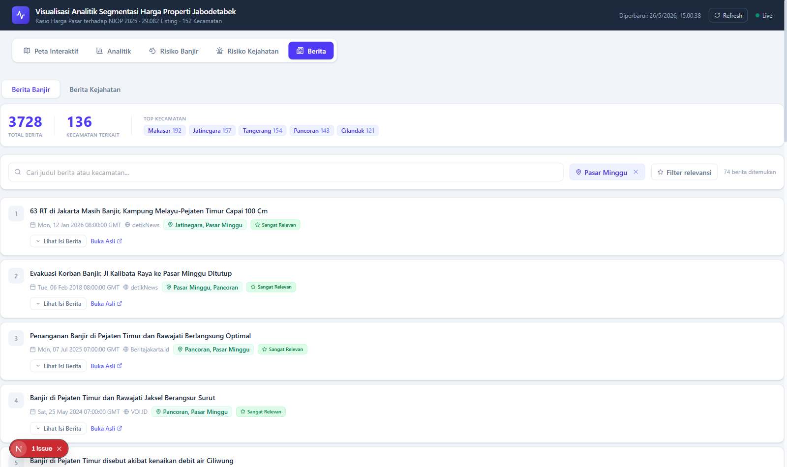
*Gambar 12: Kliping artikel berita real-time.*

1. Pilih kategori di panel kiri: **Berita Banjir** atau **Berita Kejahatan**.
2. Klik tombol merah **"Lihat Isi Berita &darr;"** pada sembarang artikel.
3. Teks paragraf artikel akan melebar (*expand*) tanpa perlu memaksa Anda membuka tab peramban baru, membuat Anda dapat membaca situasi dengan cepat dan nyaman.

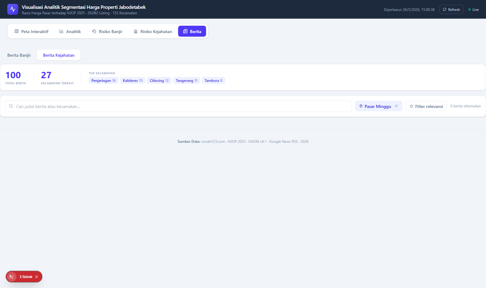
*Gambar 13: Artikel berita dapat dibaca langsung secara inline.*

---

## 8. Studi Kasus Penggunaan Praktis

### Skenario 1: Keluarga Baru Mencari Rumah Pertama (Harga Wajar & Akses KRL)
- Ubah filter global ke kelas **Menengah** atau **Rendah**.
- Masuk ke tab **Peta Interaktif**, buka menu **LAYERS** dan centang **Stasiun**.
- Cari kawasan dengan warna kuning atau hijau yang dikelilingi ikon stasiun biru (contoh: Ciputat, Serpong, atau Bojonggede).
- Klik area peta tersebut, baca ringkasannya, pastikan *Jarak Stasiun* $\le 5$ km.
- Cek tab **Risiko Banjir** untuk memastikan kawasan tersebut berstatus *Rendah* atau *Minimal*.
- Terakhir, klik peta dan tekan **"Lihat Semua Listing"** untuk memilih unit rumahnya.

### Skenario 2: Pemerintah / Penilai Pajak Melakukan Evaluasi NJOP
- Buka tab **Analitik**. Perhatikan grafik "Top 5 Kecamatan" untuk melihat area mana saja yang rasio harga pasarnya telah melampaui $4\times$ NJOP.
- Buka tab **Peta Interaktif** dan set filter segmen ke **Premium**.
- Wilayah merah tua yang menyala di peta merupakan "titik bocor" di mana potensi pajak (PBB dan BPHTB) hilang karena ketetapan NJOP saat ini tertinggal jauh di belakang kenyataan harga pasar. Kawasan ini harus diprioritaskan dalam penyesuaian tarif NJOP tahun anggaran berikutnya.

### Skenario 3: Pengembang Properti Mencari Lahan Baru (*Site Selection*)
- Cari wilayah "Blank Spot" di mana harga properti masih kuning/hijau (Segmen Menengah), namun infrastrukturnya (di panel Layers, centang Tol dan Mall) terpantau sangat padat.
- Kawasan ini menandakan potensi apresiasi *capital gain* yang sangat tinggi (karena fasilitas sudah ada tapi harga belum meroket).
- Buka tab **Berita Kejahatan** untuk menjamin wilayah lahan tersebut aman untuk dipasarkan sebagai *townhouse* eksklusif.

---
*Panduan Pengguna V.2.0 - Diperbarui secara otomatis.*
